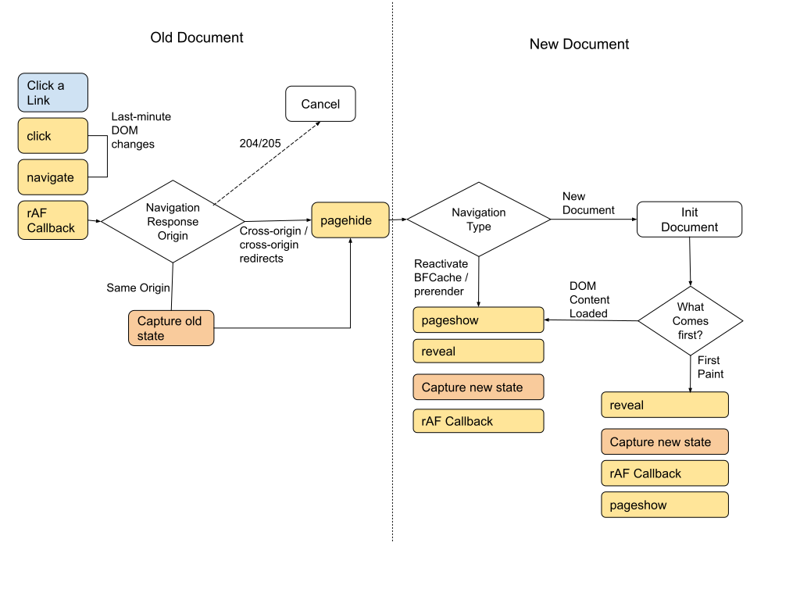

# Cross Document View Transitions

# Introduction

Cross-document View Transitions are an extension to
[same-document transitions](https://drafts.csswg.org/css-view-transitions-1/), adding the semantics
necessary to display transitions when navigating across documents.

## Scope
[The main explainer](explainer.md) and the [`css-view-transitions-1` spec](https://drafts.csswg.org/css-view-transitions-1/)
provide a detailed explanation about same-document view transitions. Most of that is applicable to
cross-document transitions as well. This document provides explanations about the additional
semantics, and how cross-document transitions work.

# Design Principles

## Compatible with same-document transitions

Developers shouldn't have to jump through hoops or rethink their transition design when switching
between an MPA architecture and an SPA architecture. The main building blocks of the transition,
the way the states are captured, the way the captured images are animated, and the JavaScript API, should remain the same, as much as possible.

## Declarative

Unlike same-origin transitions, Cross-document transitions should work automatically without JavaScript intervention. They should provide the right CSS & JavaScript knobs for when the defaults are not enough.

## Same-origin (for now)

Cross-document view transitions are only enabled for
[same-origin](https://html.spec.whatwg.org/multipage/browsers.html#same-origin) navigations without a
[cross-origin redirect](https://html.spec.whatwg.org/#unloading-documents:was-created-via-cross-origin-redirects).
In the future we could examine relaxing this restriction in some way to same-site navigations.
Cross-site view transitions are a non-goal.

# How it works

## In a nutshell
Both the old and new document need to [declaratively opt-in](#declarative-opt-in) to the transition
between them. If both opted in, and this is a [same-origin](#same-origin) navigation without
cross-origin redirects, the state of the old document is captured, using the
[same algorithm](https://drafts.csswg.org/css-view-transitions-1/#capture-old-state-algorithm) used
for same-document transitions.

When the new document is about to present the first frame, i.e. when
the document is no longer [render blocked](https://html.spec.whatwg.org/multipage/dom.html#render-blocked)
or at the course of [reactivation](https://html.spec.whatwg.org/multipage/browsing-the-web.html#reactivate-a-document) from prerendering/back-forward cache, the state of the new document is captured, also using the
[equivalent algorithm](https://drafts.csswg.org/css-view-transitions-1/#capture-new-state-algorithm).

If all conditions are met and both states are captured, the transition proceeds to
[update the pseudo element styles](https://drafts.csswg.org/css-view-transitions-1/#update-pseudo-element-styles) and display the animation, as if it was a same-document transition.

The new document can customize the style of the animation using the same CSS techniques available
for same-document transitions. Both documents can interrupt the transition in different phases, or
observe its completion.

So to support cross-document view transition, the following things need to be specified:

1. A way for both documents to [opt in](#declarative-opt-in) to the transition.
1. The [lifecycle](#lifecycle): the exact moments in which the states are captured.
1. A [JavaSript API](#javascript-api) to control the animation, equivalent to how same-document
   animations can be controlled.


## Declarative opt-in

w3c/csswg-drafts#8048  
w3c/csswg-drafts#9534  
w3c/csswg-drafts#8783

To enable cross-document transitions, the old and new documents need to be coordinated with each
other - as in, the transition names in the old document match the ones in the new document and the
effect of animating between them is intentional. Otherwise, there could be a situation where two
documents of the same origin define styles for same-document transitions independently, and enabling
this feature would create an unexpected transition between them.

This is an issue that is specific to cross-document transitions, as same-document transitions are
triggered imperatively in the first place.

The minimal functional opt-in would be a global declaration that the document supports view
transitions:

```css
@view-transition {
   navigation: auto;
}
```

Opts a document in to transitions for navigations that are:
  * push or replace, excluding reloads, and not from browser UI
  * history traversal, with or without user involvement

`@view-transition` can be nested within conditional group rules to e.g.
conditionally opt-out depending on reduced-motion preferences:

```css
@view-transition {
   navigation: auto;
}
@media (prefers-reduced-motion) {
  @view-transition {
    navigation: none;
  }
}
```

## Lifecycle



### Capturing the old state

[The old state is captured](https://drafts.csswg.org/css-view-transitions-1/#capture-old-state-algorithm) right before the old document is hidden and a new one is shown.
In the HTML spec that moment is defined [here](https://html.spec.whatwg.org/#populating-a-session-history-entry:loading-a-document).
This can either happen during normal navigations, when the new document is about to be created,
in Back/Forward cache navigations, or when activating a prerendered document.

Before creating the new document (or activating a cached/prerendered one), the UA would [update the rendering](https://html.spec.whatwg.org/#update-the-rendering) and snapshot the old document, in the same manner a document is snapshotted for a same-document navigation.

### Capturing the new state

The [new state is captured](https://drafts.csswg.org/css-view-transitions-1/#capture-new-state-algorithm) right before the first [rendering opportunity](https://html.spec.whatwg.org/#rendering-opportunity)
of the new document. This allows the new document to use the
[render-blocking mechanism](https://html.spec.whatwg.org/#render-blocking-mechanism) as a way to
delay the transition.

As shown in the chart above, that first rendering opportunity can come in two cases, either
it's a newly initialized document that's no longer [render-blocked](https://html.spec.whatwg.org/multipage/dom.html#render-blocked), or it's a document that's been frozen due to back-forward cache
or prerendered, and is now being activated.

Note: relying on the [render-blocking](https://html.spec.whatwg.org/multipage/dom.html#render-blocked) mechanism is limited, as only a limited set of elements participate in that
mechanism. See [proposal to extend it](https://github.com/whatwg/html/issues/9332).

## JavaScript API

To fullfill the design principle of making cross-document transitions [compatible with same-document transitions](#compatible-with-same-document-transitions), cross-document transition need to be as
customizable as same-document transitions, while allowing good defaults that work declaratively.

Same document transitions can be programatically extended (until the [updateCallbackDone](https://drafts.csswg.org/css-view-transitions-1/#dom-viewtransition-updatecallbackdone) promise is fullfilled), [skipped](https://drafts.csswg.org/css-view-transitions-1/#dom-viewtransition-skiptransition), programatically animated using the [ready](https://drafts.csswg.org/css-view-transitions-1/#dom-viewtransition-ready) promise, and their [end time can be
observed](https://drafts.csswg.org/css-view-transitions-1/#dom-viewtransition-finished).

To achieve the same level of control for cross document navigations we propose two new events, corresponding to last pre-snapshot moment in the old and new documents.

### `pageconceal`

whatwg/html#9702

To allow customizing a view transition from the old document, fire a `pageconceal` event just before capturing snapshots on the outgoing document. This allows the author
to customize or skip a view transition based on the final destination URL:

Note: `event.activation` is a `NavigationActivation`, see the [NavigationActivation explainer](https://github.com/WICG/view-transitions/blob/main/navigation-activation-explainer.md).

```js
window.addEventListener("pageconceal", event => {
  if (!event.viewTransition)
    return;
  const path = new URL(event.activation.entry).pathname;
  if (path === '/logout') {
    // No transition to logout page.
    event.viewTransition.skipTransition();
  } else if (path === '/home') {
    // Don't capture navigation-bar animation when navigating to home.
    navigationBar.viewTransitionName = "none";
  }
});
```

Reusing the `navigate` or `pagehide` events was considered. `navigate` doesn't work because it doesn't provide the final URL (after redirects), doesn't fire for all navigation types, and fires before the page would be frozen for snapshot capture. `pagehide` doesn't work because the capture needs to asynchronously update the rendering which shouldn't happen after `pagehide`.

### `pagereveal`

whatwg/html#9315  
w3c/csswg-drafts#8682  
w3c/csswg-drafts#8805

To allow customizing a view transition from the new document, fire a `pagereveal` event at the first render opportunity when loading or activating (from BFCache/prerender) a document.
If a view transition was started by the old document, `pagereveal` will provide the `ViewTransition` object.

Note that this event is different from [`pageshow`](https://html.spec.whatwg.org/#event-pageshow) as
a newly initialized document fires `pageshow` is only once the document is fully loaded.

A potential alternative would be to expose it via `document.activeViewTransition` or `document.pendingViewTransition`. This would be available only before the document gets render-unblocked for the first time or at reactivation. This was discarded in favor of `pagereveal` as developers would have to remember to query for this both at initialization and reactivation, which could become a footgun.

```js
document.addEventListener("pagereveal", event => {
   if (!event.viewTransition)
      return;
   const from_path = new URL(navigation.activation.from).pathname;
   // Skip transitions from home
   if (from_path === "/home")
      event.viewTransition.skipTransition();
   // Apply a different style when going "back"
   const is_back = navigation.activation.navigationType === "traverse" &&
      navigation.activation.entry?.index === (navigation.activation.from?.index - 1);
   document.documentElement.classList.toggle("back-nav", is_back);
});
```

# Further discussions

See [the list of open issues labeled `css-view-transitions-2`](https://github.com/w3c/csswg-drafts/issues?q=css-view-transitions-2+label%3Acss-view-transitions-2) for the up-to-date list of issues, and w3c/csswg-drafts#8804 for the main discussion about
cross-document transitions.
